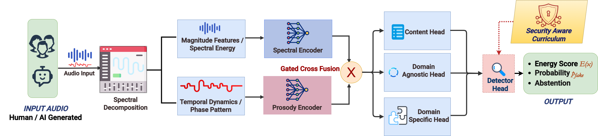

## 📘 Abstract

Modern audio deepfake detectors remain brittle under unseen vocoders, codec distortions, and small adversarial perturbations.
**AudioShieldNet (ASNet)** introduces the first *defense-in-depth* audio security framework, integrating:

* Dual spectral–prosodic encoders
* Energy-gated cross-fusion
* Cross-Modal Robustness Alignment (CMRA)
* A staged robustness curriculum (SAM → Energy → OOD → Adversarial)

ASNet achieves **state-of-the-art unseen-vocoder, codec-shift, and adversarial robustness**, while maintaining competitive in-domain accuracy.

---

# 🚀 Key Features

### **🔹 Dual-View Architecture**

* **Spectral encoder:** 80-bin log-mels
* **Prosody encoder:** f0, energy, ZCR, spectral flux

### **🔹 Energy-Gated Fusion**

* Learns dynamic modality reliability
* Ensures robustness under codec and channel shift
* Produces **confidence + abstention**

### **🔹 Cross-Modal Robustness Alignment (CMRA)**

* Margin-capped cosine stability
* Prevents spectral–prosodic collapse
* Preserves complementary cues

### **🔹 Security-Aware Training Curriculum**

1. Base detector
2. SAM (sharpness-aware optimization)
3. Energy calibration
4. OOD consistency
5. Adversarial ECRM alignment

---

# 🧱 Architecture Overview


<p align="center">
  
</p>

**Figure 1. Typical vs. Security-Aware ASNet.**
(a) Standard detectors use a single spectral encoder to produce a single entangled embedding, which limits robustness under unseen vocoder/codec shifts and adversarial perturbations.
(b) ASNet (ours) employs dual spectral–prosodic encoders, energy-gated feature fusion, and a security-aware curriculum (SAM → Energy → OOD → Adversarial) to obtain a calibrated spoof probability, an energy-based confidence score *E(x)*, and optional abstention when *E(x) ≥ τ*.

---


<p align="center">
  
</p>

**Figure 2. Architecture of Security-Aware ASNet.**
Raw audio is decomposed into spectral and prosodic feature streams processed by two heterogeneous encoders.
A gated cross-fusion layer produces a shared embedding *z that feeds the detector, domain, and energy heads.
The energy head provides calibrated confidence and abstention.
A staged security-aware curriculum (SAM → Energy → OOD → Adversarial) progressively improves robustness and calibration under the digital inference-time threat model.


---

# 📊 Results

## **Table 1 — Cross-Corpus Evaluation (Train: LibriSeVoc)**

*AUC / EER (↑ higher AUC, ↓ lower EER). Baselines are not security-trained.*

| Model            | LSV (Seen)        | ASV21 (Unseen)    | WaveFake (Unseen) | FakeAVCeleb (Unseen) | CodecFake (Unseen) | Avg. ECE ↓ | Robust AUC ↑ | OOD-AUROC ↑ |
| ---------------- | ----------------- | ----------------- | ----------------- | -------------------- | ------------------ | ---------- | ------------ | ----------- |
| LCNN             | 0.946 / 0.087     | 0.742 / 0.287     | 0.804 / 0.236     | 0.731 / 0.291        | 0.552 / 0.433      | 0.26       | 0.40         | 0.50        |
| RawNet2          | 0.981 / 0.043     | 0.763 / 0.273     | 0.901 / 0.173     | 0.791 / 0.242        | 0.602 / 0.392      | 0.22       | 0.45         | 0.56        |
| AASIST           | 0.986 / 0.035     | 0.781 / 0.252     | 0.912 / 0.162     | 0.812 / 0.224        | 0.621 / 0.371      | 0.20       | 0.48         | 0.59        |
| RawNetLite       | 0.993 / 0.028     | 0.821 / 0.203     | 0.893 / 0.188     | 0.833 / 0.191        | 0.613 / 0.381      | 0.19       | 0.50         | 0.61        |
| Ren et al.       | **0.999 / 0.005** | 0.842 / 0.184     | 0.931 / 0.154     | 0.861 / 0.170        | 0.664 / 0.341      | 0.16       | 0.53         | 0.66        |
| **ASNet (ours)** | 0.998 / 0.012     | **0.862 / 0.164** | **0.941 / 0.142** | **0.882 / 0.158**    | **0.689 / 0.312**  | **0.12**   | **0.56**     | **0.71**    |

**Summary:**
ASNet improves **unseen-vocoder AUC**, **codec-shift AUROC**, and **adversarial robustness** while also reducing overconfidence (ECE).

---

## **Table 7 — Ablation of CMRA & Energy-Gated Fusion**

| Variant                  | LSV (AUC/EER)     | ASV21 (AUC/EER)   | WaveFake (AUC/EER) | OOD-AUROC ↑ | Robust AUC ↑ | ECE ↓    |
| ------------------------ | ----------------- | ----------------- | ------------------ | ----------- | ------------ | -------- |
| **Full ASNet**           | **0.998 / 0.012** | **0.862 / 0.164** | **0.941 / 0.142**  | **0.71**    | **0.56**     | **0.12** |
| No CMRA                  | 0.992 / 0.024     | 0.842 / 0.184     | 0.930 / 0.153      | 0.67        | 0.53         | 0.16     |
| Relaxed margin (m=0.95)  | 0.994 / 0.019     | 0.851 / 0.176     | 0.936 / 0.148      | 0.69        | 0.54         | 0.11     |
| Tight margin (m=0.60)    | 0.989 / 0.031     | 0.846 / 0.181     | 0.932 / 0.151      | 0.68        | 0.54         | 0.15     |
| L2 alignment             | 0.991 / 0.028     | 0.838 / 0.191     | 0.927 / 0.157      | 0.64        | 0.52         | 0.18     |
| No energy in gate (we=0) | 0.995 / 0.017     | 0.856 / 0.169     | 0.938 / 0.146      | 0.70        | 0.55         | 0.13     |

**Summary:**
CMRA and energy gating are both essential for unseen-domain robustness, calibration, and adversarial stability.

---

## **Staged Curriculum Ablation (LibriSeVoc)**

| Config            | AUC ↑     | EER ↓     | Robust AUC ↑ | Robust EER ↓ | Abstain % | AUC kept ↑ | EER kept ↓ |
| ----------------- | --------- | --------- | ------------ | ------------ | --------- | ---------- | ---------- |
| Baseline          | 0.988     | 0.031     | 0.85         | 0.21         | 18.0      | 0.910      | 0.112      |
| + SAM             | 0.991     | 0.027     | 0.86         | 0.20         | 16.3      | 0.923      | 0.104      |
| + SAM + Eng       | 0.990     | 0.028     | 0.88         | 0.18         | 17.4      | 0.936      | 0.091      |
| + SAM + Eng + OOD | 0.993     | 0.024     | 0.88         | 0.18         | 18.1      | 0.941      | 0.088      |
| **Full ASNet**    | **0.998** | **0.012** | **0.90**     | **0.16**     | 18.1      | **0.949**  | **0.079**  |

---

# 📦 Installation

### 1. Clone

```bash
git clone https://github.com/aiai-9/ASNet.git
cd ASNet
```

### 2. Environment

```bash
conda create -n asnet python=3.10 -y
conda activate asnet
```

### 3. Install dependencies

```bash
pip install -r requirements.txt
```

---

# 🏃‍♂️ How to Run

### Train

```bash
python audioshieldnet/scripts/train.py --config configs/asn_librisevoc_split.yaml
```

### Evaluate

```bash
python audioshieldnet/scripts/eval_security.py --config configs/asn_librisevoc_split.yaml --checkpoint ckpts/asnet_best.pt
```

### Security Benchmarks

```bash
python audioshieldnet/security/attacks.py --config configs/asn_librisevoc_split.yaml
```

---

# 📁 Repository Structure

```
ASNet/
├── audioshieldnet/
│   ├── data/
│   ├── engine/
│   ├── models/
│   ├── losses/
│   ├── security/
│   └── utils/
├── configs/
├── figures/
├── Scripts/
├── requirements.txt
└── README.md
```
